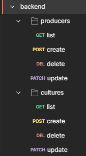
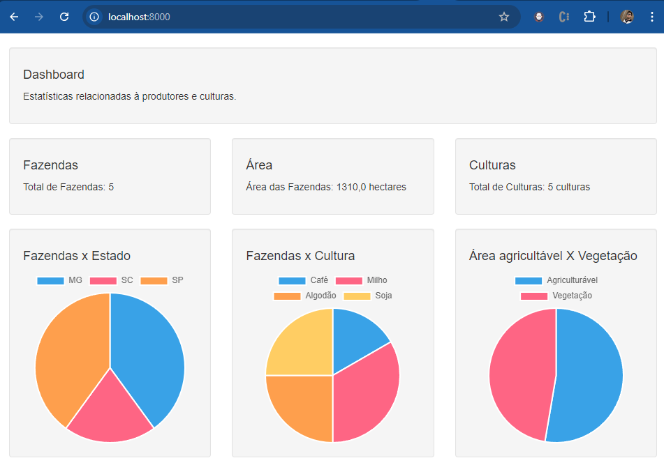
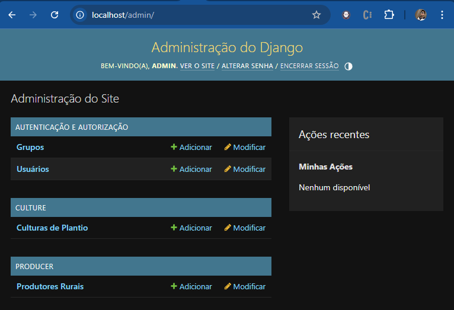
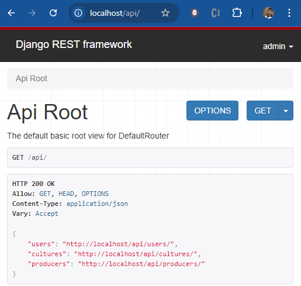
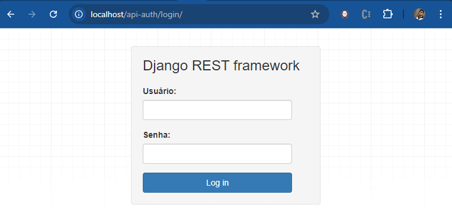
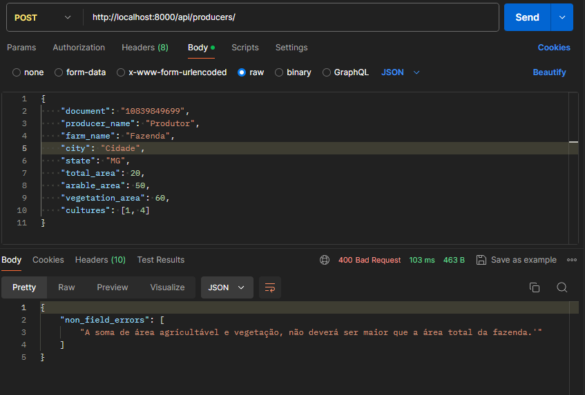
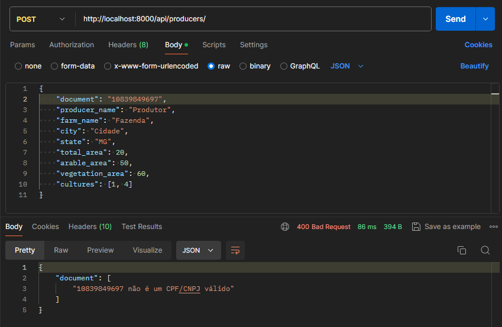

# Desenvolvimento do Projeto

## </> &nbsp;&nbsp; Informações do Projeto

- Linguagem de Programação: Python3
- Frameworks: Django + Django Rest Framework
- Base de Dados: PostgreSQL (Relacional)
- Docker (Execução da aplicação em containeres virtuais)
- Proxy Reverso: Nginx
- Servidor de Aplicação: Gunicorn

## 📖 &nbsp;Dependências para instalação do projeto

  - Caso irá executar local, instalar o banco de dados PostgreSQL com os parametros definidos em env-example
  - Caso irá executar via docker, o mesmo irá instalar as seguintes dependências automaticamente:
    - PostgreSQL
    - Gunicorn
    - Nginx
    - Bibliotecas Python através do arquivo requirements.txt

## 💻 &nbsp;&nbsp; Executando a aplicação

**Local** : Para iniciar o projeto localmente, execute os seguintes comandos:

Executar os seguintes comandos através do Terminal / Powershell:

    $ python -m venv .venv
    $ .\.venv\Scripts\activate (windows)
    $ source .venv/scripts/activate (linux)
    $ pip install -r requirements.txt
    $ python manage.py flush --no-input
    $ python manage.py migrate
    $ python manage.py collectstatic --no-input --clear
    $ python manage.py createsuperuser --no-input --username admin --email admin@admin.com
    $ python manage.py load_cultures
    $ python manage.py load_producers
    $ python manage.py test
    $ python manage.py runserver

Ao final dos comandos, a aplicação poderá ser acessada através da url: http://localhost:8000

**Docker** : Para instalar e iniciar a aplicação utilizando docker, apenas rode o comando abaixo:

    $ docker-compose -f docker-compose.yml up -d --build

Ao final do comando, a aplicação poderá ser acessada através da url: http://localhost

**Informações Mockadas** : Caso deseje iniciar o projeto com vários produtores já cadastrados, basta executar: 

    $ python manage.py load_producers

No caso de estar utilizando Docker, basta adicionar este comando no arquivo entrypoint.sh

## 🌐 Rotas de API
Rota                                | Método |  Descrição
------------------------------------ | ------  | -----
/  |  GET   |  Apresenta a página estatística do projeto
/api/  |  GET   |  Apresenta as API's Django Rest Framework
/admin/  |  GET   |  Apresenta a página administrativa do Django
/api-auth/login  |  GET   |  Rota para autenticação do Django Rest Framework
/api/dashboard  |  GET   |  Retorna os dados estatísticos para o dashboard
/api/producers  |  GET   |  Lista todos os produtores cadastrados
/api/producers/:id/  |  GET   |  Consulta determinado produtor através de seu ID
/api/producers  |  POST   |  Cadastra um novo produtor
/api/producers/:id/  |  PATCH   |  Altera dados de determinado produtor através de seu ID
/api/producers/:id/  |  DELETE   |  Deleta determinado produtor através de seu ID
/api/cultures  |  GET   |  Lista todas as culturas cadastradas
/api/cultures/:id/  |  GET   |  Consulta determinada cultura através de seu ID
/api/cultures  |  POST   |  Cadastra uma nova cultura
/api/cultures/:id/  |  PATCH   |  Altera dados de determinada cultura através de seu ID
/api/cultures/:id/  |  DELETE   |  Deleta determinada cultura através de seu ID

## ⚙️ &nbsp;&nbsp; Testes Unitários 

Execute o comando abaixo para realizar os testes unitários de forma local: 

    $ python manage.py test

Caso deseje realizar os testes por unidade de módulo (culture, producer):

    $ python manage.py test culture
    $ python manage.py test producer

## 🧐 &nbsp;&nbsp; Observações: 
    - Usuário e senha padrão (admim, admin).
    - Todas as culturas padrões já foram previamente cadastradas de forma automática.
    - Através do arquivo postman.json, o mesmo poderá ser importado na aplicação Postman a fim de realizar as requisições e interagir via API com o projeto.

## 💡 &nbsp;&nbsp; Possíveis Melhorias:
    - Adicionar permissões e autenticação JWT com certificado.
    - Adicionar Swagger ou Redoc para OpenAPI Documentation.
    - Separar cidades e estados em duas tabelas separadas.
    - Melhorar cobertura dos testes unitários.
    - Desenvolver o módulo de Fazendas / Propriedades ( producers 1:N farms).
    - Criar configurações docker para ambiente de produção.
    - Desenvolver aplicação front-end (Angular, Vue, React) evitando o server-side-rendering do Django (templates).
    - Personalizar melhor o painel administrativo

## 🖼️ &nbsp;&nbsp; Exemplos de Páginas: 

- Página das Estatísticas do Dashboard (/)

- Painel Administrativo Django (/admin/)

- Painel de API's Django Rest Framework (/api/)

- Página de Autenticação do Django Rest Framework (/api-auth/login/)

## 🖼️ &nbsp;&nbsp; Exemplos das validações: 

- Validação no Painel Administrativo de CPF/CNPJ e Área:

- Validação via API de Área:

- Validação via API de CPF/CNPJ:

